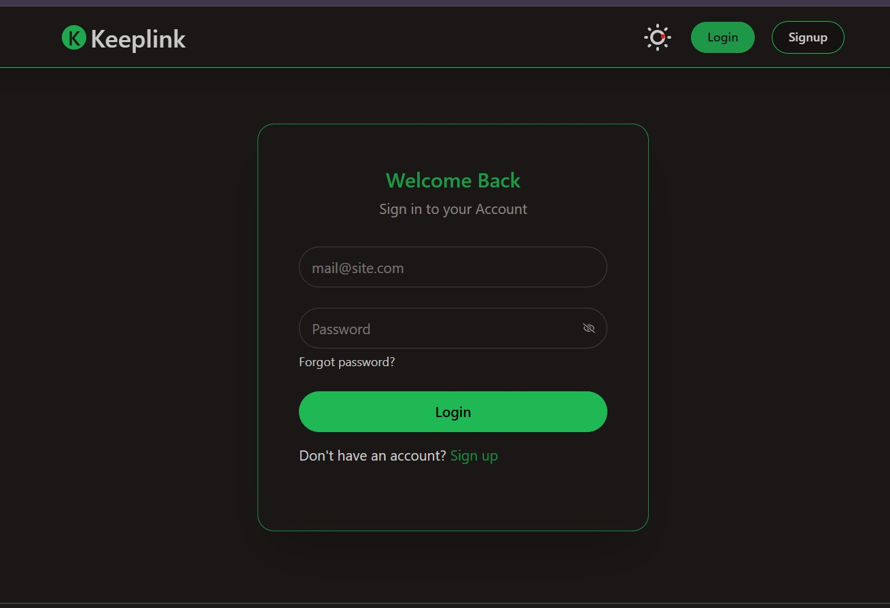
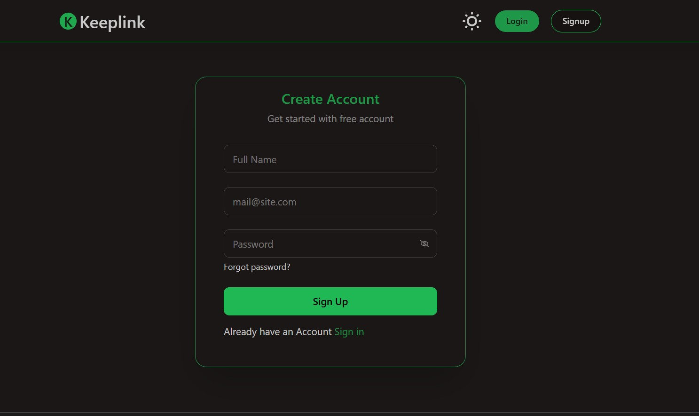

# 🔗 Link Saver + Auto-Summary

A full-stack web app that lets users:

- Sign up and log in securely
- Paste URLs to save bookmarks
- Automatically fetch the **title**, **favicon**, and **summary** using Jina AI
- View and delete bookmarks

Built with **React**, **Tailwind**, **Express**, and **MongoDB**.

---

## 🚀 Live Demo

🌐 Frontend: [jaykeeplink.netlify.app](https://jaykeeplink.netlify.app)  
🔗 Backend API: [link-saver-backend-zekn.onrender.com](https://link-saver-backend-zekn.onrender.com)  
💻 GitHub Repo: [GitHub – Jayanth-1011/Link_Saver](https://github.com/Jayanth-1011/Link_Saver)

---

## 🛠 Tech Stack

### Frontend:

- React
- Tailwind CSS + Daisy UI
- Zustand (for global state)
- Axios (with instance)
- React Router

### Backend:

- Express.js (Node.js)
- MongoDB + Mongoose
- bcrypt (password hashing)
- JWT (httpOnly cookies)
- cheerio + axios (for title & favicon scraping)
- Jina AI (for summaries)

---

## ✨ Features

- ✅ Email/password Signup & Login
- ✅ JWT authentication with httpOnly cookies
- ✅ Save bookmarks with:
  - Auto-fetched title and favicon
  - Auto-generated summary using Jina AI
- ✅ Delete bookmarks
- ✅ Responsive UI with Tailwind & Daisy UI
- ✅ Global state management via Zustand

---

## 📷 Screenshots


```md




# Clone the repo

git clone https://github.com/Jayanth-1011/Link_Saver.git
cd Link_Saver

# Install dependencies

npm install

# Create a .env file with the following variables:

MONGO_URI=your_mongodb_uri
JWT_SECRET=your_jwt_secret
NODE_ENV=development

# Start backend

npm run dev

## What I'd Do Next (if more time)


Drag & drop reorder support

Toast notifications & form validation

Better mobile UI tweaks

Write unit/component tests
```
